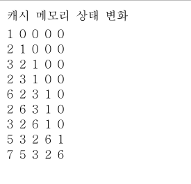

# Least Recently Used(카카오 캐시 문제 변형)

#### 캐시메모리는 CPU와 주기억장치(DRAM) 사이의 고속의 임시 메모리로서 CPU가 처리할 작업을 저장해 놓았다가 필요할 바로 사용해서 처리속도를 높이는 장치이다. 워낙 비싸고 용량이 작아 효율적으로 사용해야 한다. 철수의 컴퓨터는 캐시메모리 사용 규칙이 LRU 알고리즘을 따른다. LRU 알고리즘은 Least Recently Used 의 약자로 직역하자면 가장 최근에 사용되지 않은 것 정도의 의미를 가지고 있습니다. 캐시에서 작업을 제거할 때 가장 오랫동안 사용하지 않은 것을 제거하겠다는 알고리즘입니다.

<br/>

#### 만약 캐시의 사이즈가 5이고 작업이

|  2  |  3  |  1  |  6  |  7  |
| :-: | :-: | :-: | :-: | :-: |

#### 순으로 저장되어 있다면, (맨 앞이 가장 최근에 쓰인 작업이고, 맨 뒤는 가장 오랫동안 쓰이지 않은 작업이다.)

<br/>

#### 1) Cache Miss : 해야할 작업이 캐시에 없는 상태로 위 상태에서 만약 새로운 작업인 5번 작업을 CPU가 사용한다면 Cache miss가 되고 모든 작업이 뒤로 밀리고 5번작업은 캐시의 맨앞에 위치한다.

|  5  |  2  |  3  |  1  |  6  |
| :-: | :-: | :-: | :-: | :-: |

#### (7번 작업은 캐시에서 삭제된다.)

<br/>

#### 2) Cache Hit : 해야할 작업이 캐시에 있는 상태로 위 상태에서 만약 3번 작업을 CPU가 사용한다면 Cache Hit가 되고, 3번 앞에 있는 5, 2번 작업은 한 칸 뒤로 밀리고, 3번이 맨 앞으로 위치하게 된다.

<div style="display:flex">

|  5  |  2  |  3  |  1  |  6  |
| :-: | :-: | :-: | :-: | :-: |

-->

|  3  |  5  |  2  |  1  |  6  |
| :-: | :-: | :-: | :-: | :-: |

</div>

#### 캐시의 크기가 주어지고, 캐시가 비어있는 상태에서 N개의 작업을 CPU가 차례로 처리한다면 N개의 작업을 처리한 후 캐시메모리의 상태를 가장 최근 사용된 작업부터 차례대로 출력하는 프로그램을 작성하세요.

---

### 입력 설명

첫 번째 줄에 캐시의 크기인 S(3<=S<=10)와 작업의 개수 N(5<=N<=1,000)이 입력된다.
두 번째 줄에 N개의 작업번호가 처리순으로 주어진다. 작업번호는 1 ~100 이다.

### 출력설명

마지막 작업 후 캐시메모리의 상태를 가장 최근 사용된 작업부터 차례로 출력합니다.

### 입력예제 1

```
5 9
1 2 3 2 6 2 3 5 7
```

### 출력예제 1

```
7 5 3 2 6
```

### 참고



#### [코드보기](./solution.js)
