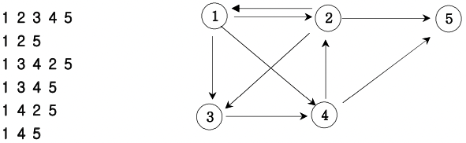

# 경로 탐색(인접행렬)

### 방향그래프가 주어지면 1번 정점에서 N번 정점으로 가는 모든 경로의 가지 수를 출력하는 프로그램을 작성하세요. 아래 그래프에서 1번 정점에서 5번 정점으로 가는 가지 수는



### 총 6가지 입니다.

---

### 입력 설명

첫째 줄에는 정점의 수 N(1<=N<=20)와 간선의 수 M가 주어진다. 그 다음부터 M줄에 걸쳐 연결정보가 주어진다.

### 출력설명

총 가지수를 출력한다.

### 입력예제 1

```
5 9
1 2
1 3
1 4
2 1
2 3
2 5
3 4
4 2
4 5
```

### 출력예제 1

```
6
```

#### [코드보기](./solution.js)
